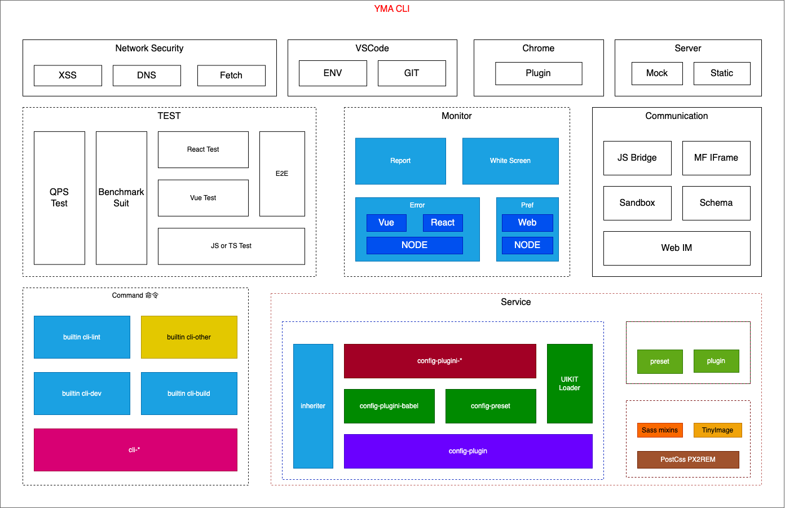

# YMA CLI

> 目标是着力于解决前端所面临的所有工程化问题

## Web 开发的快速工具

TODO 完善文档



相对于 [VUE CLI](https://cli.vuejs.org/zh/)，YMA 的优点

-   开箱即用，一站式解决工程化所面临的问题
-   支持自定义命令扩展
-   支持 Webpack 生态周边扩展
-   [presets & plugins] 简单完成已有配置的应用

## 使用

```sh
npm install yma-cli

yma <cmd> [options]
```

## 发包

```sh
# 升级版本
npm run version

# 发布
npm run publish
```

## 工程化之规范

[Technical Review](./doc/technical-review.md)
[Code Review](./doc/code-review.md)
[Unit Test](./doc/unit-test.md)
[Vue Component](./doc/vue-component.md)
[React Component](./doc/react-component.md)
[CSS Kit](./doc/css-kit.md)
[Project Folder](./doc/project-folder.md)
[Version Tag](./doc/version-tag.md)
[Git Flow](./doc/git-flow.md)

## 参与

如果你是一个 `初学者`，可以多看 YMA 文档
如果你是一个 `爱好者`，希望可以多提建议
如果你是一个 `专家`，希望多给作者一些建议

如果在使用中遇到什么问题，可以直接发邮件至 `jian958753831@qq.com`
